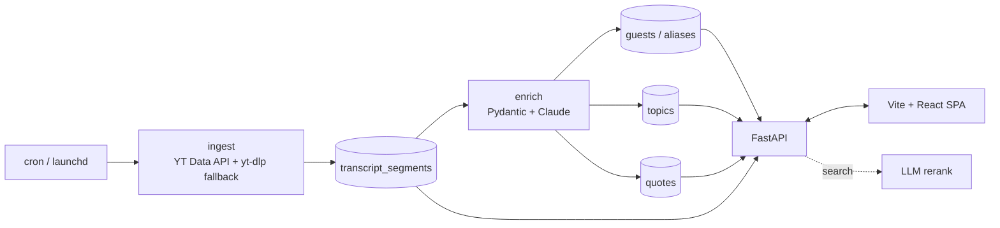

# clipdex

A locally-running tool that ingests a YouTube podcast channel's transcripts, extracts guests/topics/quotes with LLMs, lets you clip-search across episodes, and generates grounded questions for return episodes.

Companion repo for the [ai-podcast-index](https://sharmaprakash.com.np/series/ai-podcast-index/) blog series. Each post corresponds to a tag (`series3-post1`, `series3-post2`, ...) so you can check out the repo at the state described in any post.

> Reference channel: [@TheDoersglobal](https://www.youtube.com/@TheDoersglobal). The pipeline is dataset-agnostic — point it at any channel.

## Architecture



## Stack

- **Python 3.12** with [`uv`](https://docs.astral.sh/uv/) workspaces — one lockfile, one venv, hardlinked global cache.
- **FastAPI** for the local API.
- **Postgres** with `tsvector` for full-text search; LLM rerank on top (no embeddings until the corpus demands it).
- **Vite + React 19** SPA with TanStack Query and codegen'd types from `packages/shared-schema/`.
- **Provider-switching LLM client** (`packages/llm-client/`) — Anthropic / OpenAI / Ollama / fake — selected by `LLM_PROVIDER`.
- **`go-task`** for the dev workflow.

## Layout

```
clipdex/
├── packages/
│   ├── shared-schema/   # Pydantic models — single source of truth
│   ├── llm-client/      # provider-switching adapter (post 5)
│   ├── ingest/          # YT Data API + Whisper fallback (post 2)
│   ├── enrich/          # structured extraction + entity resolution (posts 3–4)
│   ├── api/             # FastAPI app (posts 6, 8)
│   └── codegen/         # schema.json -> TS types for the web app (post 7)
├── web/                 # Vite + React SPA (post 7)
├── migrations/          # SQL migrations
└── ops/                 # launchd / systemd examples (post 8)
```

## Quickstart

```sh
# Prereqs: Postgres running locally, uv installed, pnpm + Node 20+, go-task.
cp .env.example .env       # then fill in YOUTUBE_API_KEY + ANTHROPIC_API_KEY
task setup
task dev                   # API on :8000, web on :5173
```

## Scope

This is a **teaching artifact**: local-first, single-user, no auth, no deploy. Anything beyond local execution (multi-tenant, hosting, embeddings layer, alerting) is a sequel-series hook, not in scope.

## License

MIT.
